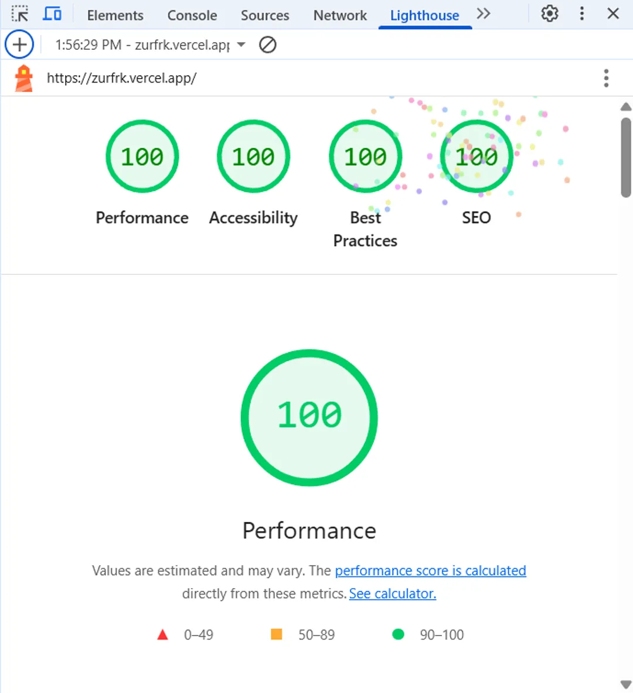

# Wachirawit Borwonsuk – Personal Portfolio

👋 Hi there! I'm **Wachirawit Borwonsuk** a passionate fullstack web developer based in Thailand.

This repository was created as my **personal portfolio site** to introduce myself, showcase my core technical skills, professional experience, and selected web development projects.

## 🔹 About Me

- 🎓 B.B.A. in Computer Information Systems – Bangkok University
- 🌐 Languages: Thai (Native), English (Intermediate)
- 🛠️ Focused on building clean, responsive, scalable web applications
- 🧠 Interested in AI-assisted development, performance optimization, and DevOps

## 🔧 Core Tech Stack

### 🌐 Frontend

| Tool                            | Why we use it                                         |
| ------------------------------- | ----------------------------------------------------- |
| **Next.js 15 (App Router)**     | React-based framework, SSG/SSR & routing in one place |
| **React 19**                    | Component model, hooks, concurrent features           |
| **TypeScript 5**                | Type-safety & DX                                      |
| **Tailwind CSS 3**              | Utility-first styling + custom gradient theme         |
| **React Icons 5**               | SVG icon set with tree-shaking                        |
| **React Intersection Observer** | Native scroll-based animations                        |
| **React Type Animation**        | Typewriter effect in Hero section                     |

### 🔗 Backend

> โปรเจกต์นี้เป็น **static/SSR portfolio** — ไม่มีฐานข้อมูลหรือ API

### 🛠️ Dev / Tooling

| Tool                                          | Role                                               |
| --------------------------------------------- | -------------------------------------------------- |
| **ESLint 9** + `eslint-config-next`           | Linting for React + TS                             |
| **Prettier**                                  | Code formatting                                    |
| **Tailwind + PostCSS & Autoprefixer**         | Build CSS pipeline                                 |
| **Bundle Analyzer** (`@next/bundle-analyzer`) | Inspect bundle size (`ANALYZE=true npm run build`) |
| **Cross-Env**                                 | Set env vars cross-platform in npm scripts         |
| **Vercel**                                    | Zero-config deploy & edge network                  |

## 💼 Experience

- **AI Prompt Evaluator (Meta via Appen)** – Evaluating LLM output (health/religion), taxonomy violation detection
- **Ad Quality Rater (Meta via Appen)** – Auditing ad content for policy compliance
- **LLM Output Evaluator** – Prompt benchmarking, tone/safety tuning
-

## 🌐 Wachirawit Borwonsuk • Portfolio

Live demo → [<https://zurfrk.vercel.app/>]

## 💻 Screenshot




## 🛠️ Quick Start

```bash
git clone https://github.com/wachirawit-borw/portfolio.git
cd portfolio
npm install     # ติดตั้ง dependencies
npm run dev     # http://localhost:3000

```

Thank you for visiting my portfolio 🙏  
Feel free to connect with me via [LinkedIn](https://linkedin.com/in/zurfrk) or check out more code on [GitHub](https://github.com/wachirawit-borw).
